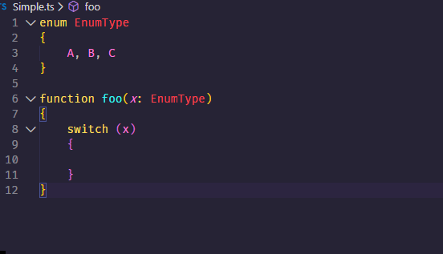

# README

A vscode extension to generate switch case for enum type.

https://marketplace.visualstudio.com/items?itemName=heroboy.generate-switch-case-for-enum-type



## How to use

Ensure the case block of switch statement is empty. Place the cursor on `switch` then the 'Show fix' icon will display.

## Supported types

```typescript
class A{}
class B{}

enum EnumType1
{
	A=123,B,C
}

const enum EnumType2
{
	A=1,B="",C=false
}

type Union1 = 1|2|true|"abc";
type Union2 = 1|2|EnumType1|boolean;
type Union3 = A|B;

```

## Todo
* Support more situation that can generate the case clauses.
* Generate correct result for js files.

## Some learning resources for writing typescript language service plugin
* https://github.com/Microsoft/TypeScript/wiki/Writing-a-Language-Service-Plugin
* https://github.com/microsoft/TypeScript/tree/master/src/services/refactors
* https://ts-morph.com/
* https://github.com/cancerberoSgx/typescript-plugins-of-mine
* https://ts-ast-viewer.com/